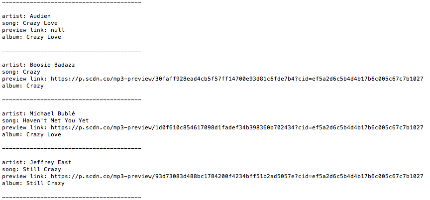

# liri-node-app

## Live Link (If relevant)
 - www.example.com

## How To Use The App
Steps:
1. npm install
2. node liri.js my-tweets
3. node liri.js spotify-this-song song name here
4. node liri.js movie-this movie name here
5. node liri.js do-what-it-says

## Requirements
#### Be sure to execute the following first:

- npm install

## Technologies Used
- Twitter API
- Spotify API
- Request (to assist with grabbing data from OMDB API)
- Node.js

## Code Explanation
In this assignment, I made LIRI. LIRI is like iPhone's SIRI. However, while SIRI is a Speech Interpretation and Recognition Interface, LIRI is a Language Interpretation and Recognition Interface. LIRI is a command line node app that takes in parameters and gives you back data.

-------------
screenshot of 'node liri spotify-this-song crazy'
